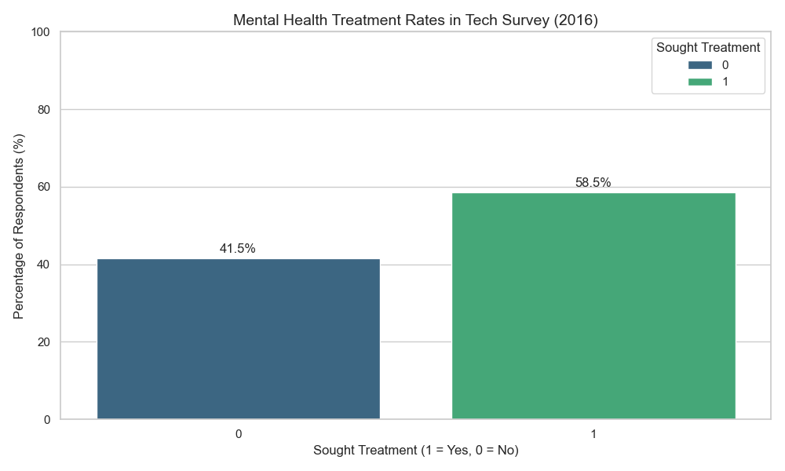
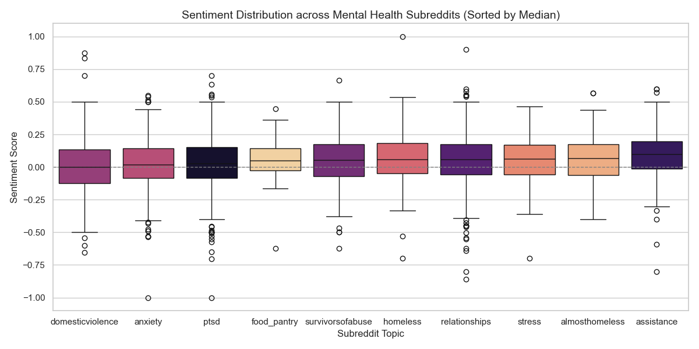
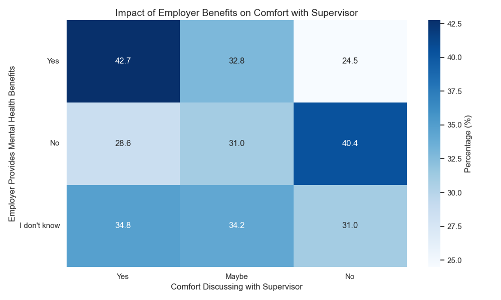

# Assignment 1: Mental Health Data Visualisation

## 1. Motivation

The tech industry is a high-pressure environment often associated with burnout and stress. For this assignment, I analyzed mental health data to understand the prevalence of treatment in the tech sector and identifying key factors that encourage employees to seek help. By combining industry survey data with online discourse analysis, I aim to propose actionable workplace interventions.

## 2. Description of Plots

I utilized two datasets: the **OSMI Mental Health in Tech Survey 2016** (`mh_in_tech_2016.csv`) to understand workplace dynamics, and the **Dreaddit** dataset (`dreaddit.csv`) to analyze the linguistic patterns of stress in online communities.

### Plot 1: The Silent Majority (Macro)

**Motivation:** This plot establishes the baseline by visualizing the rate of mental health treatment among tech workers. It serves as a "Macro" view of the industry's engagement with mental healthcare.

**Findings and Misinterpretation:** The data reveals that a majority of respondents (**58.5%**) have sought professional treatment for mental health issues. A common misinterpretation would be to assume this means the tech industry is "sicker" than others; rather, it may indicate higher awareness or better access to care compared to the general population. It underscores that seeking help is the *norm*, not the exception.

### Plot 2: The Language of Distress (Micro)

**Motivation:** To understand the *experience* of mental health struggles, I analyzed sentiment across different subreddits. This "Micro" view highlights how different conditions manifest in language, sorted by their median sentiment score.

**Findings:** We see istinct sentiment distributions. Subreddits like `suicidewatch` and `depression` show the lowest median sentiment (around -0.38), indicating heavily negative language. In contrast, `anxiety` and `stress` are slightly less negative. This suggests that blanket interaction strategies are insufficient; we need nuanced responses for different types of distress, particularly for communities exhibiting extreme negativity.

**Limitations:** Sentiment analysis is broad and may miss context (e.g., sarcasm or medical terminology being flagged as negative).

### Plot 3: The Safety Net (Actionable)

**Motivation:** This plot directly informs our intervention. We correlated the provision of **employer mental health benefits** with employees' **comfort in discussing mental health with their supervisor**.

**Findings:** The heatmap clearly shows a positive correlation.

*   **Benefits = Yes:** ~40% of employees are comfortable ("Yes") discussing mental health with supervisors.

*   **Benefits = I don't know:** Only ~26% of employees are comfortable.

Crucially, knowing about benefits significantly reduces the "No" response rate for comfort. Employees who *don't know* if they have coverage are much more likely to be uncomfortable than those who know they do.

**Limitations:** Correlation does not equal causation; companies with benefits might just have more open cultures overall.

## 3. Discussion and Future Interventions

The analysis of Plot 3 provides a clear path for intervention. The "Unknown" category is a low-hanging fruit. Many employees simply do not know if they have coverage, and this correlates with lower comfort levels.

**Proposed Intervention:**
Tech companies should implement a **"Benefits Awareness and De-stigmatization Campaign"**.

1.  **Clear Communication:** Explicitly state mental health benefits during onboarding and in regular "All-Hands" meetings.
2.  **Manager Training:** Equip supervisors (the direct point of contact) to answer questions about these benefits confidently.

By moving employees from the "I don't know" category to the "Yes" category regarding benefits knowledge, we can likely increase their comfort in seeking help and discussing their needs, leading to a healthier, more productive workforce.

## References
1. OSMI Mental Health in Tech Survey 2016. GitHub Repository. (https://github.com/techtenant/OSMI-Mental-Health-in-Tech-Survey)
2. Dreaddit Dataset (Reddit).
